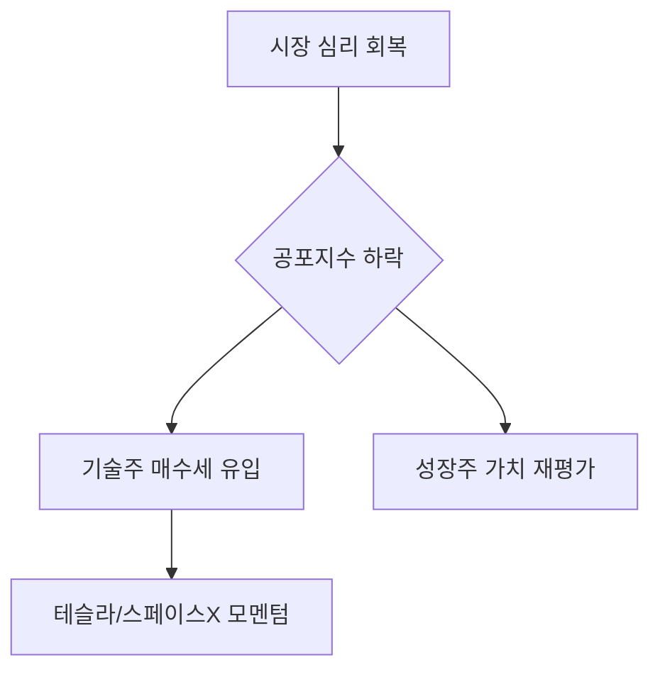

뉴욕 증시는 지수별 혼조세를 보였으나, 나스닥과 S&P500은 기술주 중심의 매수세에 힘입어 상승 마감했습니다. 특히 공포지수(VIX)가 12% 이상 급락하며 시장의 불안 심리가 빠르게 진정되는 모습입니다.

## 1. 시장 핵심 요약

최근 7일간의 데이터에 따르면 테슬라와 스페이스X를 필두로 한 혁신 기술주에 대한 투자 수요가 견고함을 확인할 수 있습니다. 다우 지수는 하락했으나 기술주 비중이 높은 지수들은 강세를 보였습니다.

### 지수별 등락 현황
| 지수명 | 종가 | 등락률 |
| :--- | :--- | :--- |
| **다우존스** | 48,908.72 | -1.20% |
| **S&P500** | 6,882.62 | +1.24% |
| **나스닥** | 22,801.56 | +1.16% |
| **공포지수(VIX)** | 19.03 | -12.59% |

## 2. 주요 지표 분석

<h3>기술주 중심의 리스크 온(Risk-on)</h3>
나스닥이 1.16% 상승하며 기술적 반등에 성공했습니다. 공포지수의 급격한 하락은 투자자들이 거시경제적 불확실성보다 개별 기업의 성장성에 다시 집중하기 시작했음을 시사합니다.

<h3>테슬라와 스페이스X의 시너지</h3>
테슬라의 자율주행 데이터 처리 역량과 스페이스X의 저궤도 위성 통신망(스타링크) 결합은 미래 모빌리티 시장의 핵심 동력입니다. 민간 우주 산업의 성장이 테슬라의 기업 가치에 긍정적인 낙수효과를 주고 있습니다.

## 3. 투자자 관전 포인트

<h3>변동성 완화와 실적 기대감</h3>
VIX 지수가 19선으로 내려오며 시장 변동성이 잦아들고 있습니다. 이는 기관 투자자들이 대형 기술주를 중심으로 포트폴리오를 재편할 수 있는 우호적인 환경을 조성합니다.

<h3>체크리스트</h3>
*   **우주 항공 섹터의 확장성**: 스페이스X의 발사 횟수 및 스타링크 가입자 증가 추이.
*   **금리 경로 및 환율**: 기술주 밸류에이션에 직접적인 영향을 주는 매크로 지표 확인.
*   **자율주행 규제 환경**: 테슬라 FSD(Full Self-Driving) 승인 관련 뉴스.

## 4. 주요 뉴스 및 참고 자료
- [Tesla's Growth Strategy and SpaceX Synergy](https://www.bloomberg.com)
- [SpaceX Mission Updates and Market Impact](https://www.reuters.com)
 

<strong>[안내 및 면책 조항]</strong> 
본 콘텐츠는 인공지능(AI) 모델을 활용하여 시장 데이터를 기반으로 자동 생성되었습니다. 
특정 종목에 대한 투자 권유가 아니며, 데이터의 지연이나 오류가 발생할 수 있습니다. 
투자에 대한 모든 책임은 투자자 본인에게 있습니다. 
내용에 오류가 있거나 저작권 문제가 발생할 경우, 관리자에게 문의하시면 즉시 삭제 또는 수정 조치하겠습니다.

