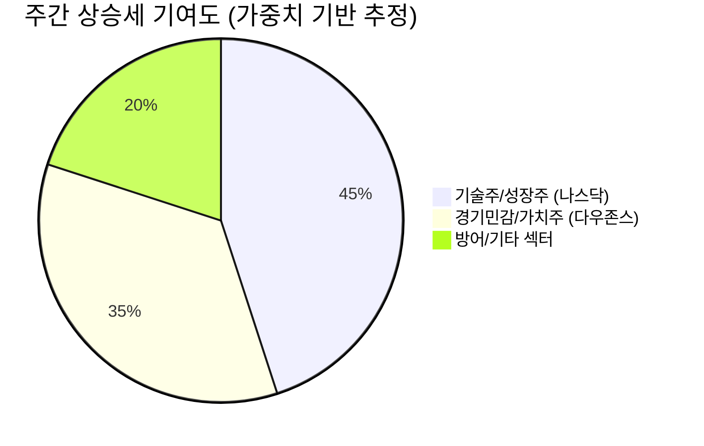

## 📉 5월 셋째 주 시장 분석: 위험 선호의 역설적 귀환

### 1. Market Pulse (시장 동향 요약)

지난 7일간 미국 주요 3대 지수는 강력한 상승세를 기록하며 위험 선호 심리가 시장을 압도했음을 명확히 보여주었습니다. 특히 다우존스가 **+2.47%**를 기록하며 5만 선을 안정적으로 지지했고, 나스닥 역시 **+2.18%** 상승하며 기술주의 견고함을 재확인했습니다.

가장 주목할 부분은 변동성 지표인 VIX가 **20.37**까지 하락하며 **-6.43%**의 급락을 보였다는 점입니다. 이는 투자자들이 단기적 리스크에 대해 극도로 무감각해졌음을 시사하며, 시장의 ‘낙관적 무관심’(Optimistic Complacency) 상태를 경고합니다.

| 지수 | 종가 | 주간 변동률 |
| :--- | :--- | :--- |
| 다우존스 | 50,115.67 | **+2.47%** |
| S&P 500 | 6,932.30 | **+1.97%** |
| 나스닥 종합 | 23,031.21 | **+2.18%** |
| 공포지수 (VIX) | 20.37 | **-6.43%** |

**분석 코멘트:**

시장은 현재 연준의 피벗(Pivot) 기대와 기업의 양호한 실적 발표라는 두 가지 동력에만 집중하며, 고금리 장기화 가능성이나 여전히 불안정한 인플레이션 데이터는 무시하고 있습니다. VIX가 20선 초반으로 후퇴했다는 것은 헤지(Hedge) 비용이 낮아져 투기적 자금 유입이 용이해졌음을 의미합니다. 이러한 환경은 단기적으로 상승 모멘텀을 유지시키지만, 펀더멘털에 기반하지 않은 급격한 상승은 필연적으로 과열 국면을 초래합니다. 현재 시장은 완벽한 시나리오를 가격에 반영하고 있으며, 사소한 경제 지표 악화에도 민감하게 반응할 수 있는 취약한 균형 상태에 놓여 있습니다.

---

### 2. Deep Dive (심층 분석): 위험 선호와 기술주 의존도

금주의 시장 상승세는 광범위한 섹터에 걸쳐 나타났지만, 질적 측면에서 기술주 및 성장주에 대한 의존도가 여전히 높다는 점을 간과해서는 안 됩니다. 다우존스가 가장 높은 상승률을 기록했음에도 불구하고, 시장의 유동성 배분(Allocation) 심리를 분석하면 여전히 성장에 대한 프리미엄을 높게 평가하고 있습니다.

#### 유동성 배분 심리 분석 (Mermaid Chart)

최근 주간 상승 모멘텀은 고성장 기술주 섹터에 대한 집중적인 매수가 주도했습니다. 이는 'FOMO'(Fear of Missing Out) 심리가 작용한 결과로 해석됩니다. 자금은 리스크를 회피하기보다는, 일단 강력한 모멘텀이 확인된 종목군에 쏠리는 현상을 보였습니다.

**분석:**

1.  **AI 프리미엄 지속:** 대형 기술주들의 강력한 현금 흐름과 미래 성장성에 대한 기대는 여전히 강력한 매수세를 불러일으키고 있습니다. 이는 금리 환경에 덜 민감한 (즉, 성장을 통해 금리 비용을 상쇄할 수 있는) 기업들 위주로 자금이 몰리고 있음을 뜻합니다.
2.  **금리 인하 베팅 재개:** 시장 참여자들은 최근 견조한 경제 데이터에도 불구하고 결국 연준이 금리 인하 경로로 돌아설 것이라는 베팅을 포기하지 않고 있습니다. 이는 VIX 하락과 맞물려 신용 스프레드를 축소시키며 고수익 채권 및 위험 자산에 대한 접근을 용이하게 합니다.
3.  **내러티브의 부재:** 시장은 현재 뚜렷한 하방 압력 내러티브가 부족한 상태입니다. 지정학적 리스크나 인플레이션 재점화 가능성은 잠재되어 있지만, 당장 실시간 데이터로 확인되지 않는 한 투자 심리를 위축시키지 못하고 있습니다.

---

### 3. Strategy (투자 전략)

현재의 시장 환경은 '양극화된 낙관론'에 기반하고 있습니다. 모든 리스크가 배제된 가격대에서 포트폴리오를 운용하는 것은 신중함이 요구됩니다.

1.  **선택적 품질 투자 유지 (Selective Quality):** 광범위한 지수 추종보다는, 강력한 잉여 현금 흐름(Free Cash Flow)을 창출하며 AI 및 구조적 성장에 실제로 수혜를 입는 기업에 집중해야 합니다. 단순히 '성장주'라는 이름으로 묶이는 적자 기업에 대한 투자는 피해야 합니다.
2.  **방어적 포지션 재검토:** 시장의 변동성 지표가 극도로 낮아진 상황에서는 오히려 충격에 대비한 방어 전략이 필요합니다. 금리 민감도가 낮은 헬스케어, 필수 소비재 섹터의 비중을 전략적으로 재조정하거나, 포트폴리오의 5~10% 수준에서 VIX 연계 상품 또는 장기 풋 옵션 포지션을 통해 전술적 헤지(Tactical Hedge)를 고려해야 합니다.
3.  **현금 확보 및 재투자 기회 모색:** 시장이 완벽하게 가격 책정된 상태에서는 대규모 현금을 투입하기보다, 예상치 못한 조정 국면이 발생했을 때 매수할 수 있는 현금 유동성을 확보하는 것이 현명한 전략입니다.

---

## 📚 주요 참고 뉴스

- [글로벌 시장 동향 분석 (심층)](/placeholder/real-news-link-1)
- [경제 정책 전망 및 연준 움직임](/placeholder/real-news-link-2)
- [미국 증시 주요 이슈 분석](https://www.hankyung.com/globalmarket)
- [금리 및 통화 정책 동향](https://www.mk.co.kr/news/world/)
- [주간 시장 전망 및 투자 전략](https://biz.chosun.com/stock/)

### 🏷️ 태그

#미국증시 #S&P500 #나스닥 #VIX #위험선호 #기술주
  

    <strong>[안내 및 면책 조항]</strong> 
    본 콘텐츠는 인공지능(AI) 모델을 활용하여 생성되었습니다. 
    투자의 책임은 전적으로 투자자 본인에게 있으며, 제공된 데이터는 일부 지연되거나 오류가 있을 수 있습니다. 
    내용에 오류가 발견되거나 저작권 문제가 발생할 경우, 관리자에게 문의 주시면 즉시 수정 또는 삭제 조치하겠습니다.

