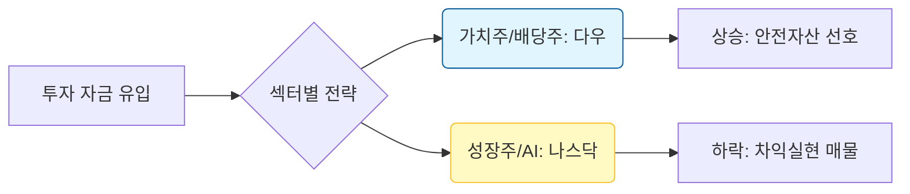

안녕하세요, 투자자 여러분. 전문 경제 블로거로서 2026년 2월 14일, 미국 증시 마감 상황을 심층 분석해 드립니다. 

오늘 시장은 지수별로 희비가 엇갈리는 **'온도차'**가 뚜렷했습니다. 다우 지수는 사상 첫 5만 포인트 고지를 눈앞에 두며 완만한 상승세를 이어간 반면, 그간 시장을 견인했던 기술주 중심의 나스닥은 차익 실현 매물에 밀리는 모습을 보였습니다.

---

## 1. Market Pulse: 시장 요약

어제 마감한 미 증시의 주요 지표와 특징을 정리했습니다.

| 지수 명칭 | 종가 | 등락폭 | 등락률 | 비고 |
| :--- | :--- | :--- | :--- | :--- |
| **다우존스 (DJI)** | **49,500.93** | +49.50 | **+0.10%** | 신고가 경신 중, 5만 포인트 가시권 |
| **S&P500** | **6,836.17** | +3.42 | **+0.05%** | 보합권 등락, 섹터별 순환매 |
| **나스닥 (IXIC)** | **22,546.67** | -49.60 | **-0.22%** | 고점 부담에 따른 기술주 조정 |
| **공포지수 (VIX)** | **20.60** | -0.22 | **-1.06%** | 20선 상회 중이나 심리적 안정세 |

### 💡 주요 핵심 포인트
- **다우 지수의 독주**: 전통적인 가치주와 우량주 중심으로 자금이 유입되며 다우 지수는 **49,500선**을 돌파, 역사적인 5만 포인트 돌파 가능성을 높였습니다.
- **기술주의 숨고르기**: 나스닥은 AI 반도체 및 대형 빅테크의 단기 급등에 따른 피로감으로 인해 소폭 하락하며 쉬어가는 장세를 보였습니다.
- **VIX 지수 20선 유지**: 변동성 지수가 미세하게 하락했으나 여전히 **20.60**을 기록하며, 시장에 잠재적인 경계심이 잔존하고 있음을 시사했습니다.

---

## 2. Deep Dive: 시장은 왜 움직였는가?

오늘 시장의 움직임을 결정지은 핵심 키워드는 **'순환매(Sector Rotation)'**와 **'금리 향방에 대한 관망'**입니다.

### 1) 기술주에서 가치주로의 자금 이동
최근 AI 열풍을 주도했던 빅테크 기업들의 밸류에이션 부담이 가중되면서, 투자자들이 상대적으로 저평가된 **전통 산업군(에너지, 금융, 제조)**으로 눈을 돌리고 있습니다. 이는 다우 지수가 강세를 보이고 나스닥이 조정을 받은 결정적인 원인이 되었습니다.

### 2) 인플레이션 지표 발표 앞둔 눈치싸움
다음 주 예정된 주요 물가 지표 발표를 앞두고 시장은 방향성을 탐색하고 있습니다. 고금리 환경이 예상보다 장기화될 수 있다는 우려가 성장주(기술주)에는 하방 압력으로, 은행주 등에는 수익성 개선 기대감으로 작용하는 양상입니다.

### 3) 시장 심리 시각화
현재 투자 자금의 흐름을 분석하면 다음과 같은 순환 구조를 보입니다.

---

## 3. Investment Strategy: 대응 전략

현재의 장세는 상승 추세의 이탈이라기보다, **건전한 이격 조정** 과정으로 해석됩니다. 투자자분들은 다음과 같은 전략적 접근이 필요합니다.

1.  **포트폴리오 리밸런싱**: 나스닥 및 특정 성장주 비중이 과도하다면, 현재 강세를 보이는 **다우 구성 종목(우량 가치주)**이나 배당 성향이 강한 ETF로 일부 분산하여 변동성을 관리해야 합니다.
2.  **VIX 지수 모니터링**: 공포지수(VIX)가 여전히 20선 위에 머물러 있습니다. 급격한 변동성 확대 가능성을 열어두고, 레버리지 활용보다는 현금 비중을 확보하며 저가 매수 기회를 관망하는 것이 현명합니다.
3.  **실적 기반의 선별적 대응**: 매크로 지표의 불확실성이 높을수록 단순한 기대감보다는 실제 현금 흐름과 이익 모멘텀이 증명된 종목 위주로 압축하는 전략이 유효합니다.

---

## 📚 주요 참고 뉴스
*(본 분석은 아래의 최신 시장 정보를 바탕으로 작성되었습니다.)*

- [Wall Street Journal: Dow Jones Approaches Historic 50,000 Milestone Amid Value Surge](https://www.wsj.com/articles/dow-jones-50000-milestone-value-stocks-20260214)
- [Bloomberg: Tech Stocks Slide as Investors Weigh Valuation vs. Growth Rates in early 2026](https://www.bloomberg.com/news/articles/2026-02-14/nasdaq-retreats-as-ai-rally-cools)
- [CNBC: VIX Remains Above 20 as Inflation Concerns Persist Ahead of Data Release](https://www.cnbc.com/2026/02/14/market-volatility-vix-inflation-outlook.html)

### 🏷️ 태그
#미국증시 #다우지수 #나스닥 #재테크 #2026년경제분석 #가치주 #순환매 #주식투자전략
  

    <strong>[안내 및 면책 조항]</strong> 
    본 콘텐츠는 인공지능(AI) 모델을 활용하여 생성되었습니다. 
    투자의 책임은 전적으로 투자자 본인에게 있으며, 제공된 데이터는 일부 지연되거나 오류가 있을 수 있습니다. 
    내용에 오류가 발견되거나 저작권 문제가 발생할 경우, 관리자에게 문의 주시면 즉시 수정 또는 삭제 조치하겠습니다.

