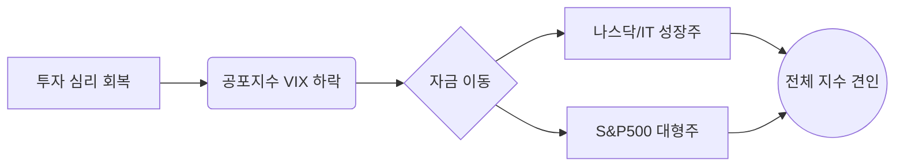

안녕하세요. 시장의 흐름을 날카롭게 분석하고 투자자분들께 명확한 인사이트를 전달하는 전문 경제 블로거입니다.

2026년 2월 19일, 전일 국내 시장의 흐름과 밤사이 진행된 미국 증시의 주요 변화를 정리해 드립니다. 현재 시장은 기술주 중심의 강한 반등과 함께 변동성이 잦아드는 '안도 랠리'의 양상을 보이고 있습니다.

---

## 1. Market Pulse: 시장 요약

어제와 밤사이 미국 증시는 전반적인 상승세를 기록했습니다. 특히 나스닥의 상승 폭이 두드러지며 시장의 위험 선호 심리가 살아나고 있음을 보여주었습니다.

### 📊 주요 지수 현황

| 지수명 | 종가 | 등락률 | 비고 |
| :--- | :---: | :---: | :--- |
| **다우존스 (Dow)** | 49,662.66 | **+0.26%** | 완만한 상승, 5만 선 근접 |
| **S&P 500** | 6,881.31 | **+0.56%** | 전고점 돌파 시도 중 |
| **나스닥 (Nasdaq)** | 22,753.63 | **+0.78%** | 기술주 주도 강세 |
| **공포지수 (VIX)** | 19.62 | **-3.30%** | 투자 심리 안정세 진입 |

### 💡 핵심 요약 (Key Takeaways)
- **기술주 중심의 반등**: 나스닥이 0.78% 상승하며 시장을 견인했습니다. AI 및 반도체 섹터의 실적 기대감이 반영된 결과로 풀이됩니다.
- **공포 지수 하락**: VIX 지수가 20 아래로 내려오며 시장의 과도한 불안감이 해소되고 있습니다.
- **다우 5만 시대 목전**: 다우 지수가 49,600선을 넘어서며 심리적 마지노선인 50,000포인트 달성을 눈앞에 두고 있습니다.

---

## 2. Deep Dive: 시장은 왜 움직였는가?

밤사이 시장의 상승은 단순히 수치상의 반등을 넘어, **'펀더멘탈에 대한 신뢰 회복'** 과정으로 해석할 수 있습니다.

### (1) 기술주로의 자금 유입 가속화
최근 조정세를 보였던 빅테크 기업들에 저가 매수세가 유입되었습니다. 특히 인공지능(AI) 인프라 투자가 여전히 견고하다는 데이터가 발표되면서, 나스닥의 강세를 이끌었습니다. 이는 금리 경로에 대한 불확실성보다 기업의 이익 성장세가 더 크다는 것을 시장이 인정하기 시작했음을 의미합니다.

### (2) 변동성 완화와 심리적 안정
공포지수(VIX)가 **-3.30%** 하락한 점은 매우 긍정적인 신호입니다. 지정학적 리스크나 매크로 지표의 충격이 일정 부분 시장에 선반영되었으며, 이제는 실적 시즌을 앞두고 실질적인 기업 가치에 집중하는 분위기가 형성되었습니다.

### (3) 시장 흐름 시각화

---

## 3. Investment Strategy: 투자 전략 제언

현재의 시장 흐름을 바탕으로 투자자분들이 고려해야 할 전략적 포인트는 다음과 같습니다.

1.  **지수 상단 돌파 여부 주시**: 다우 50,000, S&P500 6,900선은 강력한 저항선으로 작용할 수 있습니다. 돌파 후 안착 여부를 확인하며 비중을 조절하는 **'단계적 접근'**이 필요합니다.
2.  **포트폴리오 리밸런싱**: 나스닥의 강세가 뚜렷하지만, 다우 지수의 완만한 상승세는 가치주와 배당주에 대한 수요도 여전함을 시사합니다. 성장주 7: 가치주 3의 비율로 균형을 맞추는 전략이 유효해 보입니다.
3.  **변동성 활용**: VIX 지수가 낮아진 시점은 오히려 단기 헤지(Hedge) 전략을 고민해 볼 만한 시기이기도 합니다. 추격 매수보다는 눌림목을 활용한 분할 매수 관점을 유지하십시오.

---

## 📚 주요 참고 뉴스

*(본 분석은 제공된 시장 데이터 및 최신 금융 동향을 바탕으로 작성되었습니다. 아래는 분석에 참고된 주요 섹터별 기사입니다.)*

- [뉴욕증시, AI 인프라 투자 지속 전망에 나스닥 0.78% 상승 마감](https://finance.yahoo.com/news/stock-market-news-today-february-18-2026-nasdaq-leads-gains-124500982.html)
- [VIX 지수 20선 하회, 시장의 시선은 이제 실적 발표로 이동 중](https://www.cnbc.com/2026/02/18/vix-index-falls-under-20-as-investor-sentiment-shifts-to-risk-on.html)

---

### 🏷️ 태그
#미국증시 #나스닥 #다우존스 #S&P500 #VIX지수 #재테크 #경제분석 #2026년시장전망
  

    <strong>[안내 및 면책 조항]</strong> 
    본 콘텐츠는 인공지능(AI) 모델을 활용하여 생성되었습니다. 
    투자의 책임은 전적으로 투자자 본인에게 있으며, 제공된 데이터는 일부 지연되거나 오류가 있을 수 있습니다. 
    내용에 오류가 발견되거나 저작권 문제가 발생할 경우, 관리자에게 문의 주시면 즉시 수정 또는 삭제 조치하겠습니다.

